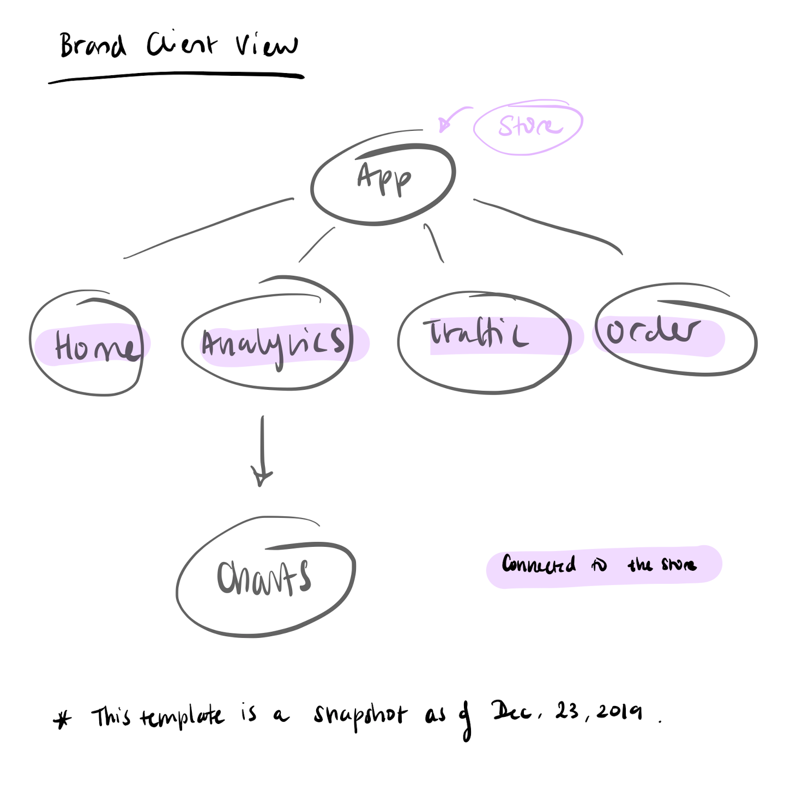

# _Klein and Wolfe: Client Side Portal_

#### _A Online Client Management System, December 23,2019_

#### _By **Jennifer Batara**_

## Description

This application is a work in progress. Some of the functionality described here is still under development.

This application is a serverless React web application for the ficitonal management consulting company, Klein and Wolfe. As a management consulting firm specializing in ecommerce strategy, they require a portal that can organize all their Service Provider (partner) relationships with their different brand clients. The portal aims to streamline the process to transfer raw data from the service providers to the in-house consulting team for analysis, and finally served to the client as real time analytics. This app incorporates a few different views: an owner view, an employee view, and a client view. The owner will have administrative powers to oversee all data and projects. Employees are only allowed to see data for projects which they are assigned. Clients will only be able to see data that belongs to them. 

The API that serves the data to this application can be found [here](https://github.com/jbatara/KleinAndWolfeAPI.git).

## User Stories
- As the owner, I want to be able to see a list of all my partners, clients, and employees and be abel to have the ultimate administrator authority to edit permissions, etc.
- As the owner, I want to be able to see a dashboard of all current projects and most recent data recieved, with any length of time since the last data dump longer than 24 hours highlighted.
- As an employee, I want to be able to see all the projects that I am currently working on, as well as a dashboard of the most recent data recieved and a warning if it has been more than 24 hours.
- As a brand, I want to be able to see a live stream of my data and live dynamic analytics. 
- As a brand, I also want to be able to see my contact person at Klein and Wolfe.

## Client Side Routing and Component Design


## Setup/Installation Requirements

-   Internet Connection
-   Internet browser
-   Bash Terminal
-   Node.js
-   Node Package Manager (npm)

If you do not have the Node.js installed on your computer, please install it by following the directions for your operating system [here](https://nodejs.org/). The Node.js version used for this project is v10.16.0. NPM is installed with Node.js. The current version of npm used for this project is v6.11.3. If you need npm support, visit npm's website [here](https://www.npmjs.com/get-npm).


To view locally please copy the link to [this repo](https://github.com/jbatara/KleinAndWolfePortal) and type the following command into your Bash terminal:
```
$git clone repo_url
```

with repo_url being the url that was just copied. To open the console app, navigate to the local directory which the online repository was cloned to using the command

```
$cd KleinAndWolfePortal
```

Once in the correct repository, and confirming that you have Node.js installed, install the required dependencies using the following command
```
$npm i
```

Once npm has restored the required dependencies, run the app with the command
```
$npm start
```
Navigate to the [local host link](http://localhost:3000) and enjoy!


## Known Bugs

_There are currenly no bugs reported._

## Support and contact details

Please feel free to contact the developer by raising a new [issue](https://github.com/jbatara/KleinAndWolfePortal/issues/new) on the github repo. You can browse the current issues [here](https://github.com/jbatara/KleinAndWolfePortal/issues).

## Technologies Used

* Javascript
* Node.js
* React
* Webpack
* Moment.js
* Nivo

### License

_MIT_

Copyright (c) 2019 **_Jennifer Batara_**